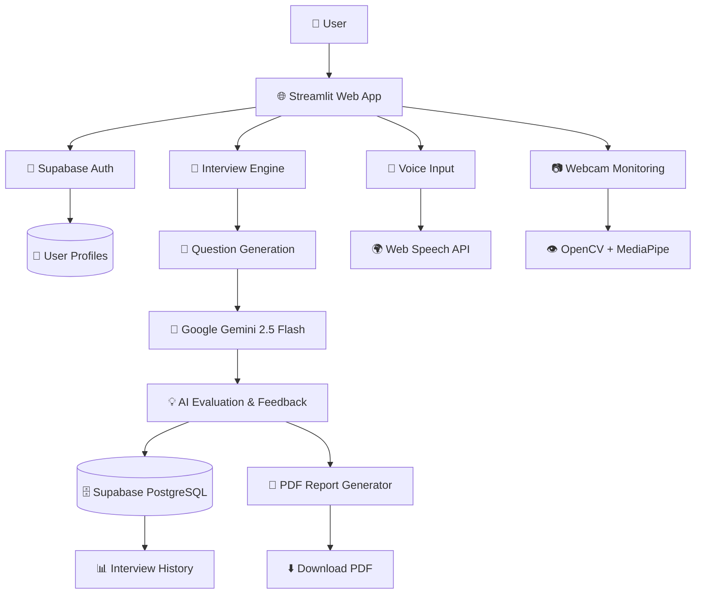

# 🎯 AI Interview Coach


 


> An AI-powered mock interview platform built with **Python** and
> **Streamlit** that simulates real interview experiences with adaptive
> questions, AI-driven evaluation, voice input, webcam-based proctoring,
> and detailed performance reports.

------------------------------------------------------------------------

# 🚀 Live Demo

> 🌐 Live Application:
> https://ai-interview-coach-4710.streamlit.app/

------------------------------------------------------------------------

# 📸 Screenshots

Add screenshots after deployment.

-   Login
-   Dashboard
-   Interview Screen
-   AI Evaluation
-   Final Report
-   Interview History

------------------------------------------------------------------------

# ✨ Features

## 🎤 Interview Engine

-   Multiple job roles
    -   Python Developer
    -   Java Developer
    -   Data Analyst
    -   Frontend Developer
-   Experience levels
    -   Beginner
    -   Intermediate
    -   Advanced
-   Interview types
    -   Technical
    -   HR
    -   Mixed
-   Static question bank
-   AI-generated interview questions using Google Gemini

## ☁️ Cloud Backend

-   Supabase Authentication
-   PostgreSQL Database
-   Row Level Security (RLS)
-   Secure cloud storage for interview history

------------------------------------------------------------------------

## 🤖 AI Evaluation

Choose between:

-   Local evaluator
-   Google Gemini AI evaluator

Each answer includes:

-   Score
-   Strengths
-   Missing concepts
-   Suggested improvements
-   Ideal answer

------------------------------------------------------------------------

## 🎙️ Voice Input

-   Browser-based speech recognition
-   Web Speech API
-   Chrome & Edge support
-   Edit transcript before submission

------------------------------------------------------------------------

## 📷 Webcam & Proctoring

-   Optional webcam monitoring
-   Face detection using OpenCV
-   Basic posture and framing analysis
-   Confidence score estimation
-   Automatic webcam snapshots
-   Fullscreen interview mode
-   Tab-switch detection
-   Copy-paste detection
-   Proctoring event logging

------------------------------------------------------------------------

## 📊 Professional Report

-   Overall interview score
-   Technical score
-   Communication score
-   Confidence score
-   Performance band
-   Question-wise feedback
-   Charts (Bar + Radar)
-   AI feedback
-   Ideal answers
-   PDF download

------------------------------------------------------------------------

## 🔐 Authentication

-   User Registration
-   User Login
-   Password hashing using bcrypt
-   Secure authentication using Supabase Auth
-   Session management

------------------------------------------------------------------------

## 📋 Interview History

-   Save completed interviews
-   Review previous interviews
-   Delete interviews
-   Download previous reports

------------------------------------------------------------------------

# 🛠 Tech Stack

  Layer             Technology
  ----------------- -------------------------------------
  Frontend          Streamlit
  Language          Python 3.12
  AI                Google Gemini 2.5 Flash
  Voice             Web Speech API
  Computer Vision   OpenCV
  Charts            Matplotlib
  PDF               fpdf2
  Database          Supabase PostgreSQL
  Authentication    Supabase Auth
  Deployment        Streamlit Community Cloud

------------------------------------------------------------------------

## 🏗️ Architecture



------------------------------------------------------------------------

# 📁 Project Structure

``` text
AI-Interview-Coach/
│
├── .streamlit/
│   └── config.toml
├── modules/
│   ├── ai_evaluator.py
│   ├── supabase_client.py
│   ├── auth_service.py
│   ├── db_service.py
│   ├── gemini_service.py
│   ├── interview_engine.py
│   ├── report_generator.py
│   ├── session_manager.py
│   ├── voice_service.py
│   └── webcam_service.py
├── app.py
├── requirements.txt
├── .gitignore
├── README.md
└── .env.example
```

------------------------------------------------------------------------

# ⚙️ Installation

## Clone

``` bash
git clone https://github.com/tirthrmodi4710/AI-Interview-Coach.git
cd AI-Interview-Coach
```

## Create Virtual Environment

``` bash
python -m venv venv
```

Activate:

Windows

``` bash
venv\Scripts\activate
```

Linux/macOS

``` bash
source venv/bin/activate
```

## Install

``` bash
pip install -r requirements.txt
```

## Configure Environment

Create `.streamlit/secrets.toml`

```toml
GEMINI_API_KEY="your_api_key"
SUPABASE_URL="your_supabase_url"
SUPABASE_KEY="your_supabase_anon_key"
```

Get a free API key from https://aistudio.google.com

## Run

``` bash
streamlit run app.py
```

------------------------------------------------------------------------

# 🔑 Environment Variables

| Variable | Description |
|--------- |-------------|
| GEMINI_API_KEY | Google Gemini API Key |
| SUPABASE_URL | Supabase Project URL |
| SUPABASE_KEY | Supabase Anon Key |

------------------------------------------------------------------------

# 📦 Dependencies

``` text
streamlit
google-generativeai
supabase
postgrest
python-dotenv
opencv-python
mediapipe
Pillow
matplotlib
fpdf2
numpy
```

------------------------------------------------------------------------

# 🧠 Workflow

``` text
User Registration / Login
        ↓
Supabase Authentication
        ↓
Interview Configuration
        ↓
Answer via Text or Voice
        ↓
Gemini AI Evaluation
        ↓
Optional Webcam Analysis
        ↓
Performance Report
        ↓
Interview Saved to Supabase
        ↓
PDF Download
```

------------------------------------------------------------------------

# 🔒 Security

-   Secure authentication is handled by Supabase Auth.
-   User interview data is stored in Supabase PostgreSQL.
-   Row Level Security (RLS) ensures users can only access their own data.
-   API keys are excluded from Git using `.gitignore`.
-   Production deployments use Streamlit Secrets.

------------------------------------------------------------------------

# 🚀 Future Enhancements

-   Cloud Storage
-   Resume Upload
-   Personalized Interview Recommendations
-   Admin Dashboard
-   Analytics
-   Multi-language Interviews

------------------------------------------------------------------------

# 👨‍💻 Author

**Tirth Modi**

-   GitHub: https://github.com/tirthrmodi4710

------------------------------------------------------------------------

# 📄 License (Will Update)

This project is licensed under the MIT License.

------------------------------------------------------------------------

⭐ If you found this project useful, consider giving it a star on
GitHub!

------------------------------------------------------------------------

> Built with ❤️ using Python, Streamlit, and AI